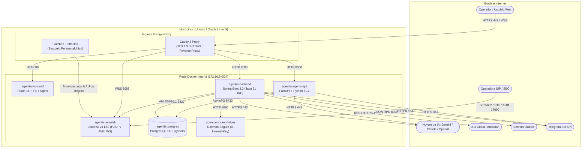
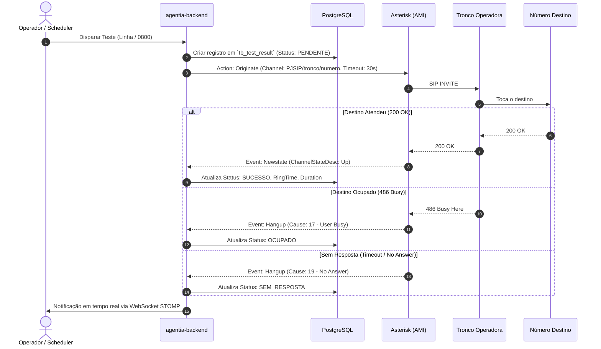
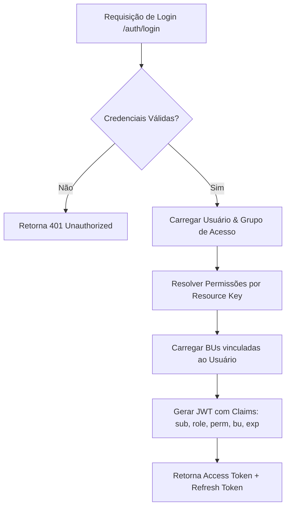

# Arquitetura e Engenharia de Software — AgentIA

> **Classificação:** Documento Arquitetural (ADR / C4 Model / DevSecOps)  
> **Versão do Sistema:** AgentIA v3.2  
> **Padrão Arquitetural:** Clean Architecture + Modular Microservices + Event-Driven Telephony

---

## 1. Visão Executiva e Princípios de Engenharia

O **AgentIA** é uma plataforma corporativa integrada de alta disponibilidade projetada para unir **Telefonia VoIP de Missão Crítica (Asterisk 21 LTS)**, **Inteligência Artificial Generativa Multimodal (Google Gemini, OpenAI, Claude)** e **Automação Autônoma de Infraestrutura (Python FastAPI + AsyncIO)**.

### Princípios Norteadores de Arquitetura:
1. **Segurança por Design (Zero Trust & Zero Secrets):** Nenhuma credencial ou chave de API trafega em código ou logs. Isolamento rigoroso de containers e menor privilégio operacional.
2. **Isolamento de Falhas e Resiliência (HA):** Falhas em componentes externos (ex: indisponibilidade de IA ou Jira) ativam *Circuit Breakers* e fallbacks determinísticos sem derrubar a sinalização de telefonia.
3. **Privacidade Estrita de Dados (CDR Non-Masking):** Telefones de origem/destino e registros de chamadas (CDR) são preservados integralmente para conformidade regulatória e auditoria corporativa.
4. **Isolamento Multitenancy por Business Unit (BU):** Segregação lógica de chamadas, testes e relatórios por unidade de negócio com governança por RBAC Granular.

---

## 2. Diagrama de Arquitetura de Containers (C4 Model — Nível 2)



---

## 3. Componentes da Solução e Responsabilidades

### 3.1. `agentia-caddy` (Proxy Reverso & Edge Security)
- **Tecnologia:** Caddy v2.
- **Funções:**
  - Terminação TLS automática (Let's Encrypt / ZeroSSL) com renovação transparente via protocolo ACME.
  - Roteamento de tráfego HTTP/REST, WebSocket STOMP (`/ws-telecom`) e WebRTC Asterisk WSS (`/asterisk-ws`).
  - Compressão Zstandard/Gzip e injeção de cabeçalhos de segurança OWASP (`HSTS`, `X-Frame-Options`, `X-Content-Type-Options`, `Content-Security-Policy`).

### 3.2. `agentia-backend` (Core Telecom & Governança)
- **Tecnologia:** Spring Boot 3.3, Java 21 LTS, Flyway, Spring Security, Dapper/JPA.
- **Funções:**
  - Gerenciamento do ciclo de vida de testes de conectividade (`ConnectivityScheduler`).
  - Integração com Asterisk via AMI (Asterisk Manager Interface) para originação assíncrona de chamadas.
  - Mecanismo de autenticação com suporte duplo: Local com **Argon2id + JWT Dual-Emit** e Corporativo com **Active Directory / LDAPS**.
  - Monitoramento de incidentes Zabbix com fila de discagem e acionamento de plantonistas.
  - Barramento de auditoria de conformidade (registra todas as alterações de configurações sensíveis com IP e usuário).

### 3.3. `agentia-asterisk` (PBX IP & Processamento de Sinal)
- **Tecnologia:** Asterisk 21 LTS compilado com `chan_pjsip`, `res_http_websocket`, `res_crypto`.
- **Funções:**
  - Sinalização SIP (PJSIP) nos canais UDP/TCP 5062.
  - Alocação dinâmica de portas RTP (`16501-17000/udp`) para transporte de áudio bidirecional.
  - Gravação automática de áudio em formato PCM WAV (`/var/spool/asterisk/monitor`).
  - Softphone WebRTC via WebSocket seguro (`/ws` mapeado em `/asterisk-ws` no Caddy).

### 3.4. `agentia-agents-api` (Plataforma de Agentes de Automação)
- **Tecnologia:** Python 3.12, FastAPI, AsyncIO, SQLAlchemy Async, APScheduler.
- **Funções:**
  - Orquestração de agentes autônomos para execução de tarefas técnicas:
    - **SSH Executor:** Conexão remota e execução segura de comandos em servidores Linux/Unix.
    - **Database Executor:** Consultas e validações em bancos PostgreSQL, MySQL, Oracle, SQL Server.
    - **Web Executor:** Automação de requisições HTTP/REST, validação de status e extração de dados.
    - **Log Executor:** Coleta, parsing e detecção de anomalias em arquivos de log.
  - Agendamento flexível de execuções via expressões Cron ou intervalos de tempo.
  - Cofre de Segredos (*Secrets Vault*) com criptografia simétrica AES-256-GCM.

### 3.5. `agentia-postgres` (Camada de Dados Unificada)
- **Tecnologia:** PostgreSQL 16 + Extensão `pgvector`.
- **Funções:**
  - Persistência estruturada de dados de telecomunicações (operadoras, linhas, 0800, resultados de testes).
  - Versionamento de schema via migrações incrementais do **Flyway** (V1 até V26+).
  - Armazenamento de metadados, bases de conhecimento vetoriais e logs de execução dos agentes.

### 3.6. `agentia-docker-helper` (Gerenciador Restrito de Containers)
- **Tecnologia:** Python 3.12 Micro-daemon.
- **Funções:**
  - Isola o socket `/var/run/docker.sock` do backend principal, mitigando riscos de escalação de privilégios (*Container Escape*).
  - Expõe endpoints internos restritos autenticados por `X-Internal-Key` para restart cirúrgico de containers e reload de configurações.

---

## 4. Regras de Negócio e Mecanismos Críticos

### 4.1. Ciclo de Vida do Teste de Conectividade (Módulo 2)



### 4.2. Segurança e Autorização: Dual-Emit JWT & RBAC Granular

O sistema emprega um modelo de controle de acesso baseado em Claims com retrocompatibilidade:
1. **Claim `role`:** Papel binário tradicional (`ADMIN` ou `USER`).
2. **Claim `perm`:** Matriz granular de permissões `{ "resource_key": "r" | "w" | "rw" }` resolvida dinamicamente no momento da autenticação a partir do Grupo de Acesso do usuário (`tb_access_group`).
3. **Claim `bu` / Authorities `BU_<id>`:** Define o escopo das Unidades de Negócio autorizadas. Usuários sem perfil ADMIN têm seus filtros de SQL restritos exclusivamente aos IDs de BU vinculados no token.
4. **Streaming Tokens (`scope=stream`):** Tokens efêmeros de curtíssima duração (60 segundos) emitidos exclusivamente para autenticação de WebSockets e streaming de áudio, evitando a exposição de credenciais principais em query strings de URLs.



### 4.3. Arquitetura de Configurações em Duas Camadas (Two-Tier Zero Downtime)

O AgentIA adota um modelo de gerenciamento de configurações em dois níveis que elimina a necessidade de reinicialização de containers para alterações de negócio e integrações:

1. **Camada 1 — Infraestrutura & Bootstrap (`.env`):**
   - Chaves de conexão de banco de dados, portas de escuta e segredos mestres de infraestrutura (`SPRING_DATASOURCE_*`, `POSTGRES_PASSWORD`, `BACKEND_JWT_SECRET`).
   - Carregadas exclusivamente no arranque dos containers.
2. **Camada 2 — Negócio & Integrações Dinâmicas (`system_config`):**
   - Configurações de mensageria, Zabbix, Telegram, Active Directory, SMTP, Jira e modelos de IA.
   - Gerenciadas em banco de dados com cache em memória no Spring Boot (`ConfigService`).
   - **Dual-Write:** Ao salvar na interface Web, o backend grava no banco com efeito imediato (0 segundos de downtime) e sincroniza o arquivo `.env` como redundância física para cold-boots.

```mermaid
flowchart LR
    UI[Painel Sistema & Governança] -->|Salvar (Efeito Imediato)| Backend[Spring Boot Backend]
    Backend -->|1. Invalida Cache & Grava| DB[(Tabela system_config)]
    Backend -->|2. Persiste Backup| EnvFile[Arquivo env/.env]
    Backend -.->|Sem Reinício de Containers| Services[Serviços em Runtime: Zabbix, Telegram, AD, Jira, IA]
```

### 4.4. Arquitetura Unificada de Frontend (SPA Nativa + ReportECH UX)

A Plataforma de Agentes IA foi unificada diretamente dentro do repositório React 19 principal (`frontend/src/components/agents/`), eliminando o encapsulamento por `<iframe>`:
- **Padrão Visual Corporativo ReportECH:** Uso consistente de tipografia Geist, paleta com variáveis CSS, Badges semânticos de status (`idle`, `running`, `success`, `error`, `paused`), Cards e Tabelas padronizadas.
- **Roteamento SPA Dinâmico:** Subpáginas de agentes (`agDashboard`, `agAgents`, `agServers`, `agKnowledge`, `agLogs`, `agAlerts`, `agSecrets`, `agLlm`, `agFlows`) renderizadas diretamente pelo roteador do AgentIA com controle de acesso por RBAC.
- **Streaming WebSockets:** Conexão direta com `/agents/ws/logs/{agent_id}` para logs em tempo real sem intermediários.

### 4.5. Agent Flow Canvas & Multi-Agent Swarm (Orquestrador Visual DAG Low-Code)

O **Agent Flow Canvas** é o motor de orquestração visual de colaboração multi-agente do AgentIA:
- **Modelo de Grafo Acíclico Dirigido (DAG):** Permite encadear múltiplos agentes, gatilhos de telefonia/infraestrutura, nós cognitivos (LLM + RAG) e atuadores de remediação em uma esteira autônoma de causa e efeito.
- **Categorias de Blocos Visuais:**
  1. **⚡ Gatilhos (Triggers):** Falha em testes de 0800/DID (Módulo 2), Agendamentos Temporais Cron, Alarmes Zabbix ou Webhooks.
  2. **🔍 Coletores (Actions):** Execuções de comandos SSH em servidores Linux, consultas SQL em bancos corporativos e requisições HTTP REST.
  3. **🧠 Cognição & Decisão (Cognitive Nodes):** Avaliação de logs por LLMs (Google Gemini 2.5 Flash, Claude, OpenAI), consultas semânticas à base SOP via RAG vetorial e ramificações condicionais.
  4. **🚀 Atuadores & Auto-Cura (Actuators):** Failover dinâmico de troncos SIP via Asterisk AMI, originação de chamadas de voz com aviso falado e disparo de alertas formatados no Telegram/Jira.
- **Interpolação de Contexto em Tempo Real:** Mecanismo de templates `{{node_id.campo}}` que repassa payloads de saída de um nó como variáveis de entrada para os nós subsequentes do DAG.
- **Rastreabilidade e Linha do Tempo:** Persistência transacional em `agent_flows`, `flow_executions` e `flow_execution_steps` com telemetria precisa de duração em milissegundos e status por etapa.

### 4.6. Monitoramento e Alertas Zabbix (Módulo 3)

1. **Polling Scheduler:** O backend executa polling periódico (configurável via `ZABBIX_POLL_INTERVAL_MINUTES`) na API JSON-RPC do Zabbix.
2. **Filtragem de Severidade:** Apenas incidentes ativos com severidade igual ou superior a `ZABBIX_MIN_SEVERITY` (Padrão: 4 — High / 5 — Disaster) entram na esteira de tratamento.
3. **Fila de Acionamento:** Para cada incidente não reconhecido (*unacknowledged*):
   - Localiza a escala de plantonistas ativa no horário do incidente.
   - Origina ligação telefônica automática com sintetização do nome do host e trigger afetada.
   - Dispara notificação formatada no Telegram corporativo com botões de ação rápida.

---

## 5. DevSecOps, Resiliência e Auditoria

### 5.1. Proteção Contra Ataques de Força Bruta e SIP Scanning
- O container `agentia-security` roda com privilégios de rede (`network_mode: host`) e analisa continuamente o arquivo de log `/var/log/asterisk/full`.
- Filtros customizados do Fail2ban identificam tentativas repetidas de registro SIP não autorizado (`NOTICE.*Registration from.*failed`), requisições malformadas (*friendly-scanner*) e senhas incorretas.
- Ao ultrapassar 3 tentativas em 60 segundos, o IP de origem é banido no kernel via regras dinâmicas do `nftables`/`iptables` por 24 horas.

### 5.2. Trilhas de Auditoria Imutáveis
- Todas as mutações de dados no sistema (criação/edição/deleção de usuários, alteração de parâmetros do `.env`, disparo de testes, criação de regras de discagem) geram um registro síncrono na tabela `tb_audit_log` contendo:
  - Timestamp em UTC.
  - Identificador do operador (`changed_by`).
  - Endereço IP do cliente (`ip_address`).
  - Chave do recurso alterado e *diff* estruturado entre o valor anterior e o novo valor.
